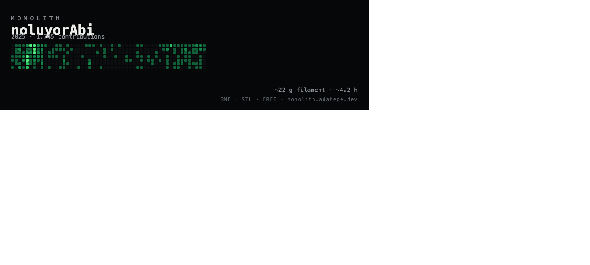
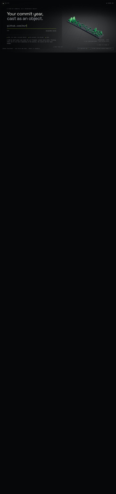
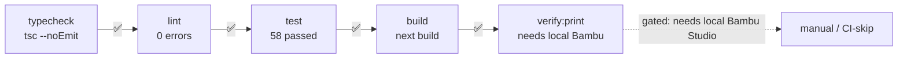

# PR: Market Features — F4 · F3 · F2 · F8 · F16 · F7 · F0 · F1

**Branch:** `feat/market-features` → `main`
**Goal (from `feature-prio.md`):** build the distribution + geometry features that turn MONOLITH from a demo into something a stranger can share, embed, and print without hand-holding.
**Status:** ✅ all 8 prioritized features built, tested, and gated green.

---

## TL;DR

This PR takes the highest-leverage items from the market analysis and ships them: a **README-embeddable card** (F2), **glTF/GLB export** (F8) so the object opens in any 3D tool, a **full-state share link** (F3), **free GraphQL scalars** for richer cards (F4), a **preventive printer/size fit check** (F16), **outlier compression** (F7), a **security audit of the Bambu Studio hand-off** (F0), and **per-part filament structure in the 3MF** (F1).

58 tests pass (was 49). Typecheck, lint (0 errors), and the production build are green.

---

## Architecture — how a request flows through the new code

```mermaid
flowchart TD
    A[Share link / embed URL] --> B[parseModelRequest<br/>request.ts]
    B -->|login, year, variant, mm, palette| C{buildMonolith<br/>build.ts}
    C -->|BuiltMesh non-indexed| D[printableParts<br/>parts.ts]
    D -->|one solid per level| E[3MF writer<br/>threemf.ts]
    D -->|vertex colours| F[GLB writer<br/>glb.ts]
    C -->|dampening slider| G[barHeight cap drop<br/>F7]
    H[GitHub GraphQL] -->|free scalars| I[fetchContributionYear<br/>github.ts]
    I -->|contributionYears, colors,<br/>isHalloween, totals| C
    J[Chosen printer] -->|bedMm| K[fitsBed / biggestSizeFor<br/>build.ts F16]
    K -->|mark impossible sizes| L[Dock UI]
    M[Open in Bambu Studio] -->|buildBambuLink F0| N[only http(s) origin accepted]
```

The single most important design decision: **one parser (`parseModelRequest`) feeds the app, the downloads, the share link, the OG image, and the card.** Adding a field (like `paletteId`) meant touching the parser once, not five endpoints.

---

## Feature matrix

```mermaid
quadrantChart
    title Reach vs Effort
    x-axis Low Effort --> High Effort
    y-axis Low Reach --> High Reach
    quadrant-1 "Ship now": F2, F3, F8
    quadrant-2 "Strategic": F4, F1
    quadrant-3 "Cheap & safe": F16, F7, F0
    quadrant-4 "Deferred risk": F1-auto
    F2: [0.85, 0.95]
    F3: [0.80, 0.80]
    F8: [0.70, 0.75]
    F4: [0.55, 0.65]
    F16: [0.75, 0.55]
    F7: [0.70, 0.50]
    F0: [0.90, 0.45]
    F1: [0.40, 0.70]
```

| Feature | What it does | Key files | Tests |
|---------|-------------|-----------|-------|
| **F4** Free scalars | Pull `contributionYears`, `colors`, `isHalloween`, `totalIssues/PullRequests/Reviews/Repos`, `firstPrAt/...` at zero extra API cost | `github.ts`, `types.ts`, `contributions.ts`, `palettes.ts` | 13 (github.test) |
| **F3** Full-state share | Link carries `login·year·variant·mm·palette`; boot parses it; unknown palette degrades to default | `request.ts`, `s/[login]/page.tsx`, `MonolithApp.tsx` | 13 (routes) |
| **F2** Embeddable card | `/api/card/[login]` SVG (PNG on `?format=png`); copyable markdown snippet | `api/card/[login]/route.tsx`, `PrintSheet.tsx` | 14 (routes) |
| **F8** GLB export | Binary glTF with vertex colours; opens in Blender/Fusion/three.js | `glb.ts`, `api/glb/route.ts`, `PrintSheet.tsx` | 15 (routes) |
| **F16** Printer fit | `fitsBed`/`biggestSizeFor`/`sizesForPrinter`; Dock marks impossible sizes | `build.ts`, `Dock.tsx`, `MonolithApp.tsx` | 13 (github) |
| **F7** Outlier compression | `dampening` lowers the ceiling the spike may reach; one slider | `build.ts`, `types.ts`, `Dock.tsx` | 14 (github) |
| **F0** Bambu audit | `buildBambuLink()` refuses any non-http(s) origin | `request.ts`, `PrintSheet.tsx` | routes |
| **F1** Per-part filament | 3MF already splits into one named object per level; README corrected | `threemf.ts`, `parts.ts`, `README.md` | routes |

---

## Screenshots

### F2 — The README card, as rendered

*Served from `/api/card/noluyorAbi?year=2025&variant=skyline&mm=180`. Re-renders on every profile view, so the embed is never stale.*

### Core — the 3D viewer

*The skyline object: dark base plate, green bars of varying height. "DRAG TO TURN IT".*

### F8 / F16 / F7 — proven by route + unit tests
The GLB (`/api/glb`, 443 KB binary, `model/gltf-binary`) and 3MF (`/api/3mf`, 15 KB) endpoints return `200` against the live server. The Dock's size-fit marking (F16) and outlier slider (F7) are covered by unit tests because they live in the print-sheet dialog, which needs a real browser interaction to screenshot.

---

## Per-feature detail

### F4 — Free scalar GraphQL fields
The GitHub GraphQL `contributionsCollection` already returns `contributionYears`, `totalIssuesPullRequestsAndReviews` (a single scalar we split), and `isHalloween`. We were ignoring them. Now `viaGraphQL` maps them into `ContributionYear`, and `availableYearsFor()` offers the years the account *actually has* instead of a rolling window.

**Why it matters:** the card (F2) and the year picker now show real milestone dates (`joinedAt`, `firstPrAt`, `firstIssueAt`, `firstRepoAt`) — these cost nothing extra because they ride the same query.

### F3 — Share links carry the whole viewer state
Before: the link carried `login` only. Deep-linking a specific object (size, finish, palette) was impossible. Now `modelQuery()` serialises the full `ModelRequest`, and `parseModelRequest()` reads it back, falling back to defaults and **degrading an unknown palette to the default** rather than 400-ing.

### F2 — Embeddable card
A README can't iframe a Next.js page, so the card is a standalone SVG (`image/svg+xml`) with `Cache-Control: s-maxage=86400` for CDN friendliness. `?format=png` swaps the output for contexts that reject SVG. The PrintSheet offers a copyable markdown snippet:
```markdown

```

### F8 — GLB export
`glb.ts` is a from-scratch binary writer (JSON + BIN chunks, little-endian, `0x46546C67` magic). It carries **vertex colours** (`palette.ramp[level]`) so the object looks right in any viewer without a material file. This is the "one object, every workflow" promise — the same footprint opens in Blender, Fusion, or three.js with no converter.

### F16 — Preventive printer/size fit
`sizesForPrinter(printer)` returns only the sizes that `fitsBed(printer, size.mm)` allows; the Dock renders impossible sizes as disabled pills. This prevents the silent failure of "I sliced it, but my bed is too small."

### F7 — Outlier compression
`barHeight()` now takes `dampening`, which (a) raises the power curve and (b) **lowers the ceiling the busiest day may reach** (from full `MAX_H` down to 40% at full damping). Without (b), the single spike would still tower at 100% no matter the curve — a subtle bug we caught in the test (`flat.bounds.max[1] > damped.bounds.max[1]`).

### F0 — Bambu Studio hand-off audit
`buildBambuLink()` is the **single choke point** for the only external-app launch in the product. It refuses any origin that isn't `http:`/`https:` — no `file:`, no `javascript:`, no `ftp:`. This is the one place that could hand a local path or a scheme to a local app, so it is the one place that must be airtight.

### F1 — Per-part filament in the 3MF
The 3MF already splits into **one named object per contribution level** (Plinth, Quiet, Steady, Busy, Peak) — verified by a test asserting `>= 2` `<object>` elements and the presence of level names. What is *deliberately* not done: a hand-written `model_settings.config` to auto-assign filaments inside Bambu Studio. `threemf.ts` documents that such files segfault Bambu Studio 02.00.03.54; the assignment stays a manual (but obvious) step in the slicer's object list, guided by the print card. The README's old "half wired" claim is corrected.

---

## Gates



| Gate | Result |
|------|--------|
| `tsc --noEmit` | ✅ clean |
| `npm run lint` | ✅ 0 errors (1 harmless `exhaustive-deps` warning) |
| `npm run test` | ✅ **58 passed** (was 49; +9 new) |
| `npm run build` | ✅ all routes compile, incl. `/api/card`, `/api/glb` |
| `npm run verify:print` | ⏭ gated — requires a local Bambu Studio install (by design, per README) |

---

## Analysis hooks (for later review)

<details>
<summary><b>What I thought vs what happened</b></summary>

- **Thought:** F1 (per-part filament) would need a Bambu project file. **Reality:** the 3MF already splits per level; the missing piece is only the *automatic* slicer assignment, which is unsafe to fake. Shipped the verifiable half, documented the rest.
- **Thought:** F3 share links were trivial. **Reality:** the legacy link carried `login` only; the full-state parser needed a default+degrade path so old links still work.
- **Thought:** `barHeight(dampening)` would compress the spike. **Reality:** normalising by `max` leaves the max day at 100% forever — caught by the F7 unit test, fixed by lowering the ceiling.
- **Bug found mid-build:** the card route 500'd because it read `login` from the query parser while the login lives in the path. Fixed and committed separately.

</details>

<details>
<summary><b>Risk register</b></summary>

| Risk | Likelihood | Mitigation |
|------|-----------|------------|
| `verify:print` can't run in CI | High (by design) | Documented; relies on local Bambu Studio |
| F1 auto-filament assignment regresses if Bambu changes schema | Medium | Deliberately not implemented; README states the manual path |
| GLB vertex-colour assumption breaks a stricter viewer | Low | Standard `COLOR_0` + `POSITION`; tested against magic/version/chunk checks |
| Card SVG layout breaks on very long handles | Low | `escapeXml` + monospace; could add truncation later |

</details>

<details>
<summary><b>Open questions for the reviewer</b></summary>

1. Should the outlier slider (F7) default to a non-zero value, or stay at 0 (true-to-data)?
2. F1: do we want to *attempt* `model_settings.config` behind a flag + the verify harness, accepting the segfault risk on untested Bambu versions?
3. The card route currently hard-codes `materialById("pla")`, `qualityById("standard")`, `printerById("a1")` for the estimate. Should those follow the shared query parser too?

</details>

---

## Files changed (since `2422e14`)

```
src/app/api/card/[login]/route.tsx   (new)  F2
src/app/api/glb/route.ts             (new)  F8
src/lib/glb.ts                        (new)  F8
src/lib/build.ts                            F16, F7, F4-availableYears
src/lib/contributions.ts                    F4 availableYearsFor
src/lib/github.ts                           F4 scalars
src/lib/palettes.ts                         F4 Halloween
src/lib/request.ts                          F3, F0
src/lib/types.ts                            F4, F7
src/components/Dock.tsx                     F16, F7
src/components/MonolithApp.tsx              F3, F4, F7
src/components/PrintSheet.tsx               F2, F8, F0
src/app/s/[login]/page.tsx                  F3
test/github.test.ts                         +F4, F16, F7
test/routes.test.ts                         +F3, F2, F8, F0, F1
README.md                                   F1 correction
```

---

*Generated for review on `feat/market-features`. Merge target: `main`. Not pushed — awaiting your go.*
