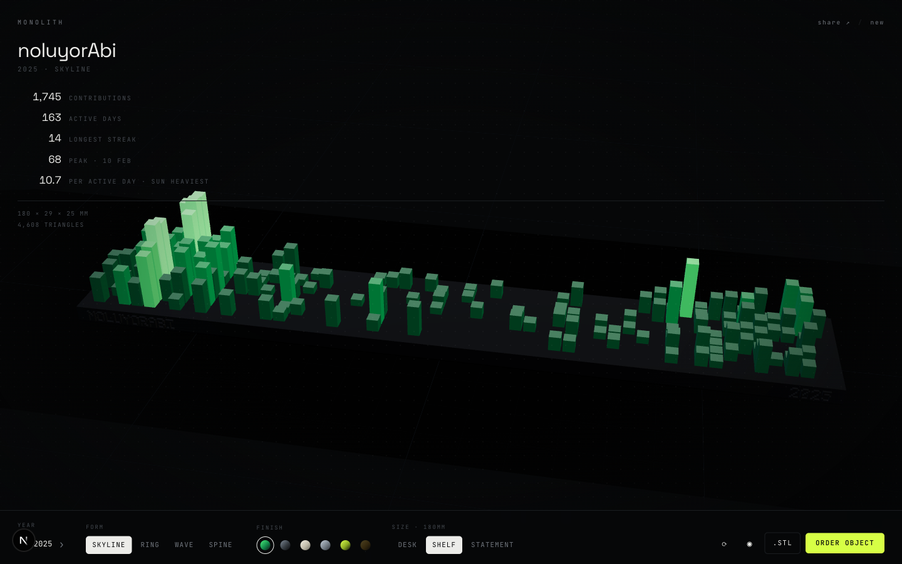
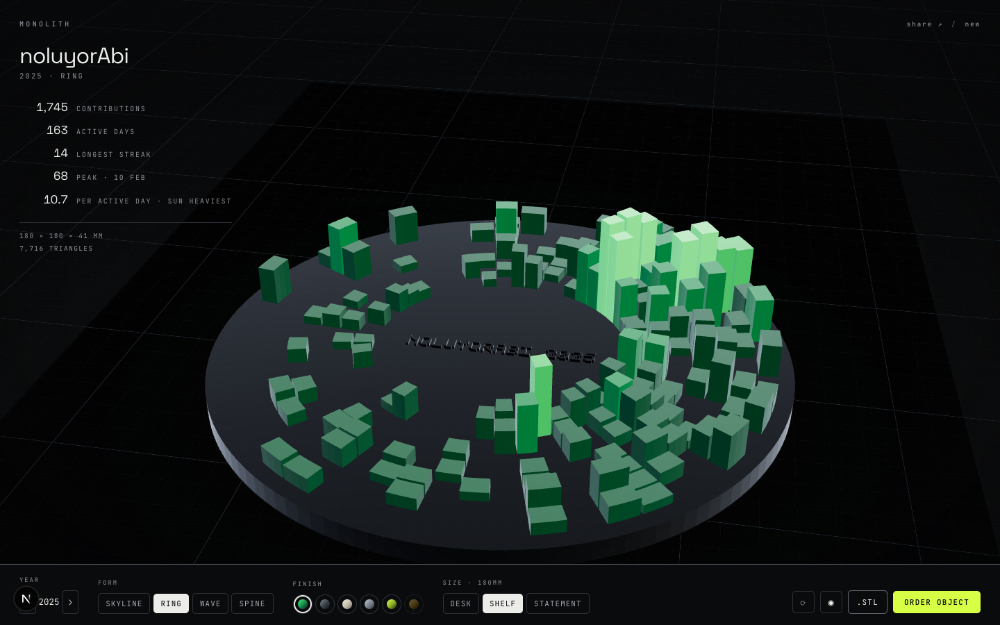
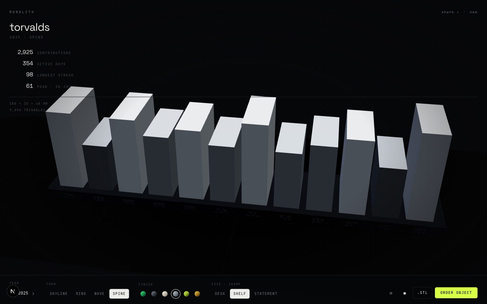

# MONOLITH

Type a GitHub handle. Watch a year of commits get extruded into a solid object. Download the files and print it.



The files are free and always will be. The whole point is that you print it yourself, so the download is the product and everything else is a footnote. If you do not own a printer we will run one for you at what it costs us, with the arithmetic shown on the checkout page, because that is a service and not a business.

MIT licensed. Self-host it, fork it, put your own name on it.

## What you get

**A print kit**, one ZIP, generated from your year:

| File | What it is |
|---|---|
| `*.3mf` | The object, split into one part per contribution intensity. Plain core 3MF, so it opens in Bambu Studio, OrcaSlicer, PrusaSlicer and Cura. |
| `*.stl` | The same object as one solid, for anything that does not read 3MF. |
| `presets/*.json` | A Bambu Studio and OrcaSlicer process preset. It `inherits` from your stock profile and only overrides what this object needs, so it keeps working when the vendor updates theirs. |
| `PRINT-ME.txt` | Every setting, why it is set that way, and what to expect on the plate. |

**Four forms**, each a different reading of the same year:

| Form | What it is |
|---|---|
| `skyline` | The full calendar, one column per day. The classic. |
| `ring` | 52 weeks bent into a circle, handle engraved in the centre disc. |
| `wave` | The calendar smoothed into one continuous surface. |
| `spine` | Twelve months, twelve towers, month names cut into the plate. |

<p align="center">
  
  
</p>

## The print profile, and why

Every override exists because of something specific about this object. Nothing else is touched, so your own defaults carry through.

| Setting | Value | Why |
|---|---|---|
| Layer height | 0.16 mm | The top face of every tower is the thing people look at. |
| Walls | 3 | A tower is 3.4 mm wide, so three walls make it effectively solid. |
| Top layers | 5 | Up to 371 small top surfaces. Anything thinner pillows. |
| Infill | 15% gyroid | Only the plinth has any volume to fill. |
| Supports | off | Every face grows straight up. There is not one overhang. |
| Wall generator | arachne | Recovers about three times more of the engraved handle at small sizes. |
| Seam | back | Your handle is engraved on the front face. The seam is kept off it. |
| Brim | none in PLA, 3 mm in PETG | PETG shrinks and this plinth is long and narrow. |

Multi-colour: the 3MF arrives as separate parts, one per intensity, so you assign a filament to each in the object list. That is two clicks per part rather than automatic, because a plain 3MF does not carry filament assignments and pretending otherwise would only break in your slicer.

## Verified, not assumed

The interesting part of this project is that the print pipeline is checked against a real slicer rather than against a specification someone remembered.

```bash
npm run dev &
npm run verify:print
```

That downloads a kit from the running server, unpacks it, hands the 3MF and the generated preset to Bambu Studio's CLI, slices, then greps the resulting gcode for all nine settings we claim to bake in. It fails loudly if any of them did not survive.

The same approach produced two findings worth writing down:

- **A hand-written Bambu project file does not work.** Embedding `project_settings.config` in the 3MF segfaults Bambu Studio 02.00.03.54 on load, and even a complete 420-key config exported by Bambu itself still fails unless the model also carries the production extension and its UUID scheme. So the kit does not fake one. Settings ship as a preset, which is the mechanism slicers actually support, and which was measured to apply cleanly.
- **The engraving threshold was measured, and the common wisdom about it is wrong.** The received advice is that Bambu's default classic perimeter generator erases any protrusion narrower than one extrusion line, so the engraved handle needs arachne to survive. Slicing the same object with and without the engraving, under both generators, says otherwise:

  | Size | Font pixel | classic | arachne |
  |---|---|---|---|
  | 180 mm | 0.47 mm | +22.53 mm | +19.50 mm |
  | 120 mm | 0.31 mm | +1.30 mm | +3.86 mm |

  Both generators print it fine once the font pixel clears the 0.42 mm line; what actually saved the handle was raising the text height. Below that threshold it collapses under both, and arachne only recovers about three times more of it. So arachne is set, but as an improvement rather than a rescue, and small sizes carry a warning instead of a promise.

- **The filament and time estimates are fitted, not guessed.** Bambu Studio sliced the same 180 mm skyline at 0.12, 0.16 and 0.20 mm. Those three runs calibrate the shell model in `src/lib/print.ts`; the fit reproduces all three to within 0.3%, and `test/calib.test.ts` fails if it ever drifts.

## Running it

```bash
npm install
npm run dev
```

That is the whole setup. Every environment variable is optional:

| Variable | Without it |
|---|---|
| `GITHUB_TOKEN` | The public contributions calendar is parsed instead of the GraphQL API. Same numbers, GitHub's own rate limits. |
| `STRIPE_SECRET_KEY` | The print service runs in demo mode: real order records, nobody is charged, the UI says so. |
| `MONOLITH_ADMIN_KEY` | `/studio` is open in development and 404s in production. It fails closed, so forgetting it never publishes the order queue. Visit `/studio?key=<value>` once; the key is exchanged for a signed 12-hour session cookie and dropped from the URL. |
| `NEXT_PUBLIC_PROJECT_URL` | Links point at this repository. |

If GitHub cannot be reached at all, the app falls back to a deterministic synthetic year and labels it `sample data` rather than quietly faking someone's history.

## Routes

| Route | Purpose |
|---|---|
| `/` | The prompt, the build, the studio. One page, three states. |
| `/s/[login]?year=` | Shareable permalink. Boots straight into the build. |
| `/api/kit?...` | The print kit as a ZIP. |
| `/api/3mf?...` | The 3MF on its own. |
| `/api/stl?...&mm=` | Binary STL, 60 to 400 mm. |
| `/api/contributions?login=&year=` | The parsed year plus derived stats. |
| `/studio` | Production bench and order queue for whoever runs the printer. |
| `/order/[token]` | Order receipt. The token is a 128-bit capability, so receipts cannot be enumerated. |

## How the geometry works

`src/lib/` is pure TypeScript with no three.js dependency, which is what lets the browser, the STL endpoint and the 3MF endpoint share one definition of the object:

- `mesh.ts` — a triangle-soup builder with boxes, annular wedges and cylinders. Winding is counter-clockwise from outside; the tests assert that every variant's outward area vectors cancel, which catches an inside-out face before a slicer rejects it.
- `build.ts` — the four forms, the engraving, the size fit.
- `font5x7.ts` — a hand-authored bitmap font. Handles are raised out of the plate as real geometry, so they survive the print rather than living in a texture.
- `parts.ts` — welds the soup and splits it by contribution level, checking each group really is a closed solid.
- `stl.ts` / `threemf.ts` / `zip.ts` — the exporters, including a small deterministic ZIP writer so the same object always yields byte-identical output.

Alongside positions, the builder emits a contribution level, a chronological order and a base height per vertex. The viewer's material reads all three: level picks the colour, order and base height drive the reveal, so the object grows out of its plate in the order the commits happened without any per-bar scene objects. The exporters read the same level attribute to split the object into printable parts.

## Legibility

A page this dark fails quietly, so the values are measured rather than eyeballed:

- Every text colour clears WCAG AA against the page. `dim`, which carries the smallest uppercase labels, sits at 6.3:1; `mute` at 8.3:1. Anything bounding a control uses `edge` at 3.4:1, above the 3:1 WCAG 1.4.11 asks for. Decorative rules keep the quieter `line`.
- Readouts sit over a live 3D canvas, so they carry their own gradient scrim. Measured against a bright tower directly behind them, the worst row still reads at 7.2:1.
- The object is nearly as dark as the page, so a Fresnel term traces its silhouette and every block edge. A pool of light on the floor gives the shape something to sit against.
- Portrait screens swing the camera down the object's long axis, so a phone gets the same object at usable size.

## Tests

```bash
npm test               # geometry, exporters, pricing, the guard on /studio
npm run verify:print   # the kit, against a real Bambu Studio install
```

## Contributing

Issues and pull requests welcome. The two rules that matter:

1. If you change the geometry, `npm test` must still pass. The winding and closure tests exist because a flipped face is invisible on screen and fatal on a printer.
2. If you change anything in the print kit, run `npm run verify:print` and say in the pull request what the slicer said.

## Stack

Next.js 16, React 19, three.js via react-three-fiber, Motion, Tailwind v4. Orders live in a flat JSON file under `.data/`; swap `src/lib/orders.ts` for a database if you ever need one.

Preset ids, filament densities and prices are read from Bambu Studio's own bundled profiles. Code is MIT; the objects it generates are yours, under CC BY 4.0.
