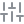

<div align="center">


<b>Turn any GitHub contribution year into a thing you can hold. Type a handle, watch it build, download a 3MF, an STL and a slicer preset that is already dialled in.</b>

<br>
<br>

<a href="https://monolith-ebon-six.vercel.app"><b>Open MONOLITH</b></a>

<code>github.com/</code><b>your-handle</b>&nbsp;&nbsp;then&nbsp;&nbsp;<code>Get the files</code>

<br>
<br>

<a href="https://github.com/noluyorAbi/monolith/stargazers"></a>
<a href="LICENSE"></a>
<a href="#verified-against-a-real-slicer-not-a-spec-from-memory"></a>

<br>

<a href="assets/demo.mp4"></a>

<sub>The GIF is a downsampled loop. Full quality: <a href="assets/demo.mp4"><code>assets/demo.mp4</code></a>.</sub>

</div>

<br>

##  Why

Every December someone posts a screenshot of their contribution graph. It is a picture of a year of work that lives for one scroll and then is gone.

This makes the same year into an object. Not a render, not a wallpaper: a watertight solid with your handle raised out of the base plate, a print profile chosen for its exact geometry, and a slicer that has been asked whether the profile actually survives.

The files are free. They stay free. If you own a printer you never need anything else on this page.

##  What you get

A print kit, one ZIP, generated from your year:

| File | What it is |
|------|------------|
| `*.3mf` | The object, split into one part per contribution intensity so you can put each on its own filament. Plain core 3MF, so it opens in Bambu Studio, OrcaSlicer, PrusaSlicer and Cura. |
| `*.stl` | The same object as one welded solid, for anything that does not read 3MF. |
| `presets/*.json` | A Bambu Studio and OrcaSlicer process preset. It `inherits` from your stock profile and overrides only what this object needs, so it keeps working when the vendor updates theirs. |
| `PRINT-ME.txt` | Every setting, the reason for it, what the print will weigh, and how long it will take. |

There is also **Open in Bambu Studio**, which hands the model straight to the app if you have it installed.

##  Four forms

The same year, read four ways.

| Form | What it is |
|------|------------|
| `skyline` | The full calendar, one column per day. The classic. |
| `ring` | 52 weeks bent into a circle, your handle engraved in the centre disc. |
| `wave` | The calendar smoothed into one continuous landscape. |
| `spine` | Twelve months, twelve towers, month names cut into the plate. |

Sizes run from 60 to 400 mm. On a 0.4 mm nozzle, 180 mm and up keeps the engraved handle readable and the towers separated; the interface tells you when your chosen size falls under that.

##  The print profile, and why each setting is there

Nothing else is touched, so your own defaults carry through.

| Setting | Value | Why |
|---------|-------|-----|
| Layer height | 0.16 mm | The top face of every tower is the thing people look at. |
| Walls | 3 | A tower is 3.4 mm wide, so three walls make it effectively solid. |
| Top layers | 5 | Up to 371 small top surfaces. Anything thinner pillows. |
| Infill | 15% gyroid | Only the plinth has any volume to fill. |
| Supports | off | Every face grows straight up. There is not one overhang. |
| Wall generator | arachne | Recovers about three times more of the engraved handle at small sizes. |
| Seam | back | Your handle is on the front face. The seam is kept off it. |
| Brim | none in PLA, 3 mm in PETG | PETG shrinks, and this plinth is long and narrow. |

Multi-colour: the 3MF arrives as separate parts, one per intensity, and you assign a filament to each in the object list. Two clicks per part, not automatic, because a plain 3MF does not carry filament assignments and pretending otherwise would only break in your slicer.

##  Verified against a real slicer, not a spec from memory

```bash
npm run dev &
npm run verify:print
```

That downloads a kit from the running server, unpacks it, hands the 3MF and the generated preset to Bambu Studio's CLI, slices, then greps the resulting gcode for all nine settings the kit claims to bake in. It fails loudly if any of them did not survive.

Three findings came out of holding the project to that standard, and each one changed the code:

**A hand-written Bambu project file does not work.** Embedding `project_settings.config` in the 3MF segfaults Bambu Studio 02.00.03.54 on load. So does a complete 420-key config exported by Bambu itself, unless the model also carries the production extension and its UUID scheme. The kit therefore does not fake a project file: settings ship as a preset, which is the mechanism slicers are built to accept, and which was measured to apply every override intact.

**`basematerials` is inert.** Grepping the importers of PrusaSlicer, OrcaSlicer, Bambu Studio and libSavitar for it returns nothing in all four. It is not emitted, and the multi-colour workflow is described as the two clicks it really is.

**The engraved handle nearly shipped broken.** Its font pixel was 0.376 mm, under the 0.42 mm line a 0.4 mm nozzle lays down. Slicing the same object with and without the lettering measured the cliff:

| Size | Font pixel | classic | arachne |
|------|-----------|---------|---------|
| 180 mm | 0.47 mm | +22.53 mm | +19.50 mm |
| 120 mm | 0.31 mm | +1.30 mm | +3.86 mm |

Raising the text is what fixed it. The widely repeated claim that this needs the arachne wall generator turned out to be false at the default size, where both generators print the lettering fine. Arachne is set because it recovers roughly three times more below the threshold, but as an improvement, not a rescue, and small sizes carry a warning rather than a promise.

The filament and time estimates are fitted the same way, against three real slices of the same year at 0.12, 0.16 and 0.20 mm, on a P1S with the stock 0.4 mm nozzle. The site quotes an A1 by default, which is the machine most people printing one of these own; only the time band is scaled for it, from Bambu's own published acceleration figures, and the filament is identical on every machine. At 0.16 mm that object is 4h00 and 17.7 cm3 of PLA, about 22 g, and the estimator puts it at 17.8 cm3. The landing therefore quotes the spread rather than one machine's midpoint: two to six hours depending on the printer, the nozzle and the layer height. The fit reproduces all three slices to within 0.3%, and `test/calib.test.ts` fails if it ever drifts. The year those slices used is committed at `data/contributions-2025.json`, and it is the same year the banner, the share card and the demo draw, so no image here shows a denser object than the one that was measured.

##  How the geometry works

`src/lib/` is pure TypeScript with no three.js dependency, which is what lets the browser, the STL endpoint, the 3MF endpoint and the README's own artwork share one definition of the object.

| File | What it does |
|------|--------------|
| `mesh.ts` | Triangle-soup builder: boxes, annular wedges, cylinders. Winding is counter-clockwise from outside. |
| `build.ts` | The four forms, the engraving, the size fit. |
| `font5x7.ts` | A hand-authored bitmap font. Handles are raised as real geometry, so they survive the print instead of living in a texture. |
| `parts.ts` | Welds the soup and splits it by contribution level, checking each group really is a closed solid. |
| `stl.ts`, `threemf.ts`, `zip.ts` | The exporters, including a small deterministic ZIP writer so the same object always yields byte-identical output. |

Alongside positions, the builder emits a contribution level, a chronological order and a base height per vertex. The viewer's material reads all three: level picks the colour, order and base height drive the reveal, so the object grows out of its plate in the order the commits happened without a single per-bar scene object. The exporters read the same level attribute to split it into printable parts, and the Remotion compositions read it again to draw the banner and the demo above. Change the geometry and every image in this README updates on the next render.

##  Running it

```bash
npm install
npm run dev
```

That is the whole setup. Every environment variable is optional:

| Variable | Without it |
|----------|------------|
| `GITHUB_TOKEN` | The public contributions calendar is parsed instead of the GraphQL API. Same numbers, GitHub's own rate limits. |
| `NEXT_PUBLIC_SITE_URL` | Canonicals, the sitemap and OG image urls fall back to the deployed domain. |
| `NEXT_PUBLIC_PROJECT_URL` | Links point at this repository. |

If GitHub cannot be reached at all, the app falls back to a deterministic synthetic year and labels it `sample data` rather than quietly faking someone's history.

### Routes

| Route | Purpose |
|-------|---------|
| `/` | The builder. |
| `/s/[login]?year=` | Shareable permalink, with a generated share card of that person's real grid. |
| `/api/kit?login=&year=&variant=&mm=&printer=&material=&quality=&slots=` | The print kit as a ZIP. |
| `/api/3mf?login=&year=&variant=&mm=` | The 3MF on its own. |
| `/api/stl?login=&year=&variant=&mm=` | Binary STL, 60 to 400 mm. |
| `/api/contributions?login=&year=` | The parsed year plus derived statistics, as JSON. |
| `/llms.txt` | Generated from the code, so an assistant reads the real forms, sizes and profile. |

##  The viewer

The object on the page is the STL you download, engraved handle included, not a lightweight stand-in. It turns under a drag and carries the throw when you let go, and the days under your pointer light up from within. The studio it stands in is yours too: key, fill, rim, a flat front lamp and the emissive glow each have their own switch in the dock, dimmed in and out rather than cut, and the shadow on the floor is cast by the real geometry, so it answers every switch. A year with no contributions refuses to build an empty plate and says so, and the current year is labelled `year to date` instead of posing as a weak one.

##  Legibility

A page this dark fails quietly, so the values are measured rather than eyeballed. Every text colour clears WCAG AA against the page: the token carrying the smallest uppercase labels sits at 6.3:1, body copy at 8.3:1, and anything bounding a control at 3.4:1, above the 3:1 WCAG 1.4.11 asks for. Readouts sit over a live 3D canvas, so they carry their own gradient scrim; measured against a bright tower directly behind them, the worst row still reads at 7.2:1. The object is nearly as dark as the page, so a Fresnel term traces its silhouette and a pool of light on the floor gives the shape something to sit against. Portrait screens swing the camera down the object's long axis, so a phone gets the same object at usable size.

##  Roadmap, and what is honestly still broken

Ordered by how much it costs you today.

**Multi colour is only half wired.** The 3MF arrives split into one solid per contribution level, which is what makes a per slot assignment possible at all, but the file carries no colour and no filament data. `basematerials` is inert in every slicer checked, and a hand written Bambu project file segfaults Bambu Studio, so nothing in the file says "peak days go in slot 2". Two colour and four colour are therefore a manual assignment in the object list, and the slot choice in the interface only reaches the printed card and the preset, never the model. Next: emit a real Bambu and Orca project 3MF, `model_settings.config` with a per object extruder plus the production extension UUIDs, behind a test that loads it through the CLI, and fall back to the plain 3MF when it cannot be produced.

**Estimates are fitted on one shape.** The shell, bulk and flow constants come from three slices of the 180 mm skyline at 0.12, 0.16 and 0.20 mm, 0.4 mm nozzle. Ring, wave and spine have a different surface to volume ratio, so for them the numbers are extrapolation wearing a band. Next: slice every form at every size and fit per form, or say per form how far the fit was tested.

**Nothing slices in CI.** `npm run verify:print` needs Bambu Studio installed locally, so the strongest test in the repository only ever runs on a machine that happens to have it. Next: pin a headless slicer in the workflow, or at minimum assert the 3MF against a schema.

**Only Bambu and Orca get a preset.** PrusaSlicer, Cura and everything else get the geometry and a text card listing every setting by hand. Next: generate a PrusaSlicer `.ini` from the same source list.

**The engraved handle is size dependent.** Below roughly 150 mm the font pixel drops under the 0.42 mm line a 0.4 mm nozzle lays down, and the interface warns instead of solving it. Next: scale the lettering with the object so it stays above one line width at every size.

**Without a token the data path is fragile.** No `GITHUB_TOKEN` means an HTML scrape that GitHub rate limits, and the app then serves a clearly labelled sample year rather than failing. Correct, but a fallback is not a feature.

**Portrait is tolerated, not designed.** The camera swings down the object's long axis so a phone gets a usable object, but the dock crowds and the idle object is small. Next: a layout that is native to the aspect rather than the same one bent.

**There is no end to end test.** Geometry, exporters and estimates are covered; the flow from typing a handle to a downloaded zip is not.

##  Licence

[PolyForm Noncommercial 1.0.0](LICENSE). Use it, change it, share it, run it yourself, for any purpose that is not commercial. Selling it, or selling a service built on it, needs a licence from me: open an issue.

The objects it generates are yours, under CC BY 4.0. It is your year.

Preset ids, filament densities and setting keys are read from Bambu Studio's own bundled profiles.

## Tests

```bash
npm test               # geometry, exporters, calibration
npm run verify:print   # the kit, against a real Bambu Studio install
npm run assets         # re-render the banner, share card and demo
```

---

<div align="center">
<sub>Built by <a href="https://github.com/noluyorAbi">noluyorAbi</a> · <a href="https://adatepe.dev">adatepe.dev</a>. If you print one, post it.</sub>
</div>
